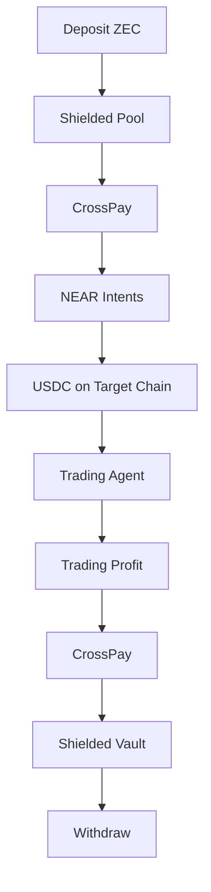

# Zaygent

> **Privacy-First Autonomous Crypto Trading Agent**  
> Built for the **Zcash Hackathon 2026** using **Zcash Shielded Transactions**, **CrossPay**, and **NEAR Intents**.


---

# Overview

Zaygent is a privacy-first autonomous cryptocurrency trading platform that uses **Zcash shielded transactions** as its funding and settlement layer.

Instead of exposing users' wallets publicly, every deposit and withdrawal is routed through **Zcash Shielded Pools** using **CrossPay** and **NEAR Intents**, giving traders strong privacy while still accessing multiple blockchains.

---

# Features

| Feature | Description |
|----------|-------------|
| Privacy First | Shielded Zcash funding and settlement |
| Autonomous Trading | AI-powered scalping and sniper strategies |
| Cross-chain | CrossPay + NEAR Intents integration |
| Live Market Data | GeckoTerminal + DEXScreener |
| 🛡 Honeypot Detection | Token safety verification |
| TP/SL Automation | Automatic profit-taking & stop-loss |
| 💰 Zcash Mainnet | Live RPC integration |
| Portfolio Tracking | Real-time positions and statistics |

---

# Application Flow



---

# Architecture

```text
zaygent/
│
├── src/
│   ├── pages/
│   ├── components/
│   ├── hooks/
│   └── constants/
│
├── server/
│   ├── routes/
│   ├── middleware/
│   ├── models/
│   └── websocket/
│
├── agent/
│   ├── engines/
│   ├── scanners/
│   ├── evaluators/
│   ├── executors/
│   └── zcash/
│
└── docs/
```

---

# Quick Start

Clone the repository

```bash
git clone https://github.com/yourusername/zaygent.git

cd zaygent
```

Install frontend

```bash
npm install
```

Install backend

```bash
cd server
npm install
cd ..
```

Install trading agent

```bash
cd agent
npm install
cd ..
```

---

# Environment Variables

<details>

<summary>server/.env</summary>

```env
PORT=5000
NODE_ENV=development
SUPABASE_URL=
SUPABASE_KEY=
JWT_SECRET=
HASH_SALT=
DEXSCREENER_BASE_URL=https://api.dexscreener.com/latest
CLIENT_URL=http://localhost:5173
AGENT_API_URL=http://localhost:5001
```

</details>

<details>

<summary>agent/.env</summary>

```env
GETBLOCK_ZEC_TOKEN=
LUNARCRUSH_API_KEY=
SERVER_URL=http://localhost:5000
SCAN_INTERVAL=30
AGENT_API_PORT=5001
```

</details>

---

# Database Setup

<details>

<summary>Supabase SQL</summary>

Paste your SQL schema here.

</details>

---

# Running the Application

Open **three terminals**.

### Frontend

```bash
npm run dev
```

Runs on

```
http://localhost:5173
```

---

### Backend

```bash
cd server

npm run dev
```

Runs on

```
http://localhost:5000
```

---

### Trading Agent

```bash
cd agent

npm run dev
```

Runs on

```
http://localhost:5001
```

---

#  Usage

### 1️⃣ Fund Account

- Generate your Zcash deposit address
- Deposit ZEC
- Funds are automatically shielded

---

### 2️⃣ Configure Agent

- Risk level
- Position size
- Take Profit
- Stop Loss
- Supported chains

---

### 3️⃣ Enable Autopilot

The agent automatically

- scans markets
- checks liquidity
- verifies honeypots
- opens positions
- monitors TP/SL
- exits trades

---

### 4️⃣ Manual Sniper

Paste a contract address

or

Click **SNIPE** from the Markets page.

---

### 5️⃣ Withdraw

Withdraw profits back through

CrossPay

↓

Zcash

↓

Destination Wallet

---

# Privacy Architecture

```text
Wallet Address
        │
        ▼

SHA-256 Hash

        │
        ▼

Database

        │
        ▼

CrossPay

        │
        ▼

Shielded Zcash Pool

        │
        ▼

Withdrawal
```

---

# Live Data Sources

| Source | Purpose |
|---------|---------|
| GetBlock.io | Zcash Mainnet RPC |
| GeckoTerminal | Token Prices |
| DEXScreener | Liquidity |
| CoinCap | ZEC Price |
| Honeypot.is | Token Safety |
| Alternative.me | Fear & Greed Index |

---

# Tech Stack

| Layer | Technology |
|---------|------------|
| Frontend | React + Vite |
| Backend | Node.js + Express |
| Database | Supabase |
| Blockchain | Zcash Mainnet |
| Cross-chain | CrossPay + NEAR Intents |
| Authentication | JWT |
| Real-Time | Socket.IO |

---

# Roadmap

- [ ] Native Zcash SDK
- [ ] Full NEAR Intents SDK
- [ ] Live DEX Execution
- [ ] Hardware Wallet Support
- [ ] Mobile App
- [ ] Performance Analytics
- [ ] Security Audit

---

# ✅ Hackathon Compliance

| Requirement | Status |
|--------------|--------|
| Zcash Mainnet Integration | ✅ |
| Open Source | ✅ |
| Setup Documentation | ✅ |
| Privacy First | ✅ |
| Security | ✅ |

---

## Transparency — What's Real vs. Conceptual

We believe in being fully transparent with judges and the community about the current state of this hackathon build.

### ✅ Fully Real (Live, Verifiable)

| Feature | Verification |
|---------|-------------|
| Zcash mainnet connection | Live RPC via GetBlock.io — real block height, real Sapling/Orchard pool balances, real chain supply |
| Zcash mainnet address generation | Valid `t1...` transparent address, Base58Check encoded with correct mainnet prefix — verifiable on [zcashblockexplorer.com](https://zcashblockexplorer.com) |
| Live token market data | Real prices, liquidity, and volume from GeckoTerminal and DEXscreener |
| Live ZEC/USD price | Real-time from CoinCap API |
| Live Fear & Greed Index | Real-time from Alternative.me |
| Honeypot detection | Real API calls to honeypot.is for ETH/BSC tokens |
| Liquidity verification | Real liquidity data pulled from DEXscreener before every trade |
| TP/SL evaluation | Real-time price tracking against live market data |

### Conceptual / Simulated (Architectural Prototype)

Zaygent's **CrossPay** flow (ZEC shielded vault → NEAR Intents → target chain → back to ZEC vault) is **modeled directly on Zcash's real, shipped "Zashi CrossPay" feature** (launched by Electric Coin Company, September 2025), which lets shielded ZEC holders send private payments in any NEAR-supported cryptocurrency.

In this hackathon build, our CrossPay implementation is a **functional architectural simulation**:
- The 3-step flow (Shield → NEAR Intents Solve → Deliver) is animated in real time in the UI and logged step-by-step in the agent
- Transaction hashes are simulated (prefixed `SIM_`, `ZEC_SHIELD_`, `NEAR_INTENT_`, etc.) — no real shielded transaction is broadcast to the Zcash network yet
- No real NEAR Intents SDK call is made yet

**Why we built it this way:** Executing real signed shielded Zcash transactions requires either a full Zcash node wallet or a production-grade signing library, which — combined with real NEAR Intents SDK integration — was outside the safe scope for a hackathon timeline without risking real funds or an unstable demo. We prioritized building the complete, correct architecture and proving genuine mainnet read-access first.

### Path to Full Production

Post-hackathon, the roadmap to make CrossPay fully real:
1. Integrate a proper Zcash transaction-signing library (or full node wallet) for real shielded transaction broadcast
2. Integrate the real NEAR Intents SDK for actual cross-chain settlement
3. Connect real DEX execution (Jupiter, PancakeSwap, Uniswap) in place of simulated swaps
4. Security audit before handling real user funds at scale

We wanted judges to see exactly where the real blockchain interaction is (mainnet RPC, address generation) versus where the architecture is proven but not yet live (CrossPay execution), so there is no ambiguity about the current state of the build.

---

---

# Team

Built by Web3Cryptic for the **Zcash Hackathon 2026**

---

# License
This project is licensed under the MIT License — see the [LICENSE](./LICENSE) file for details.

---

## ⭐ If you found this project interesting, consider giving it a star!